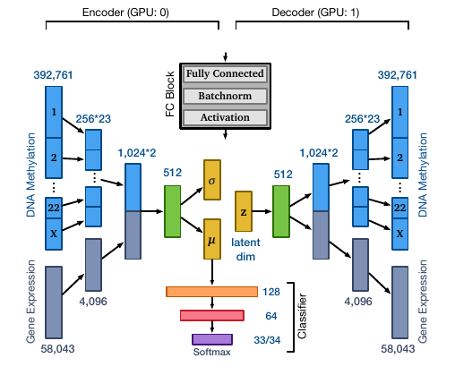
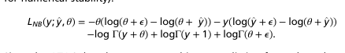
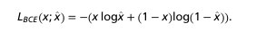
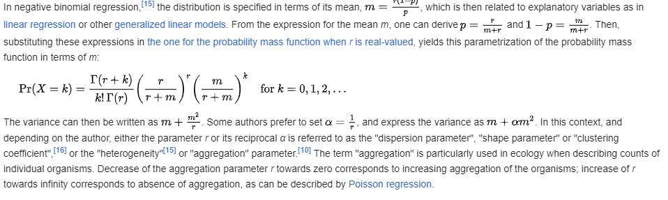
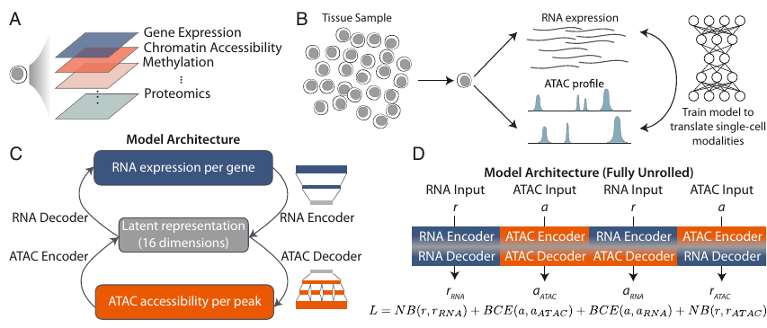
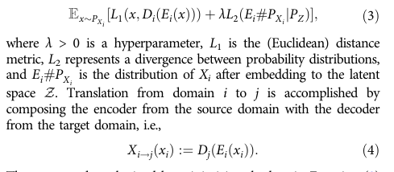
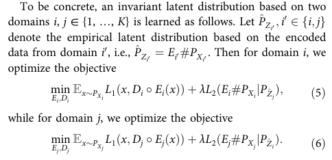
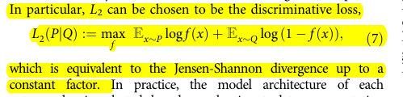
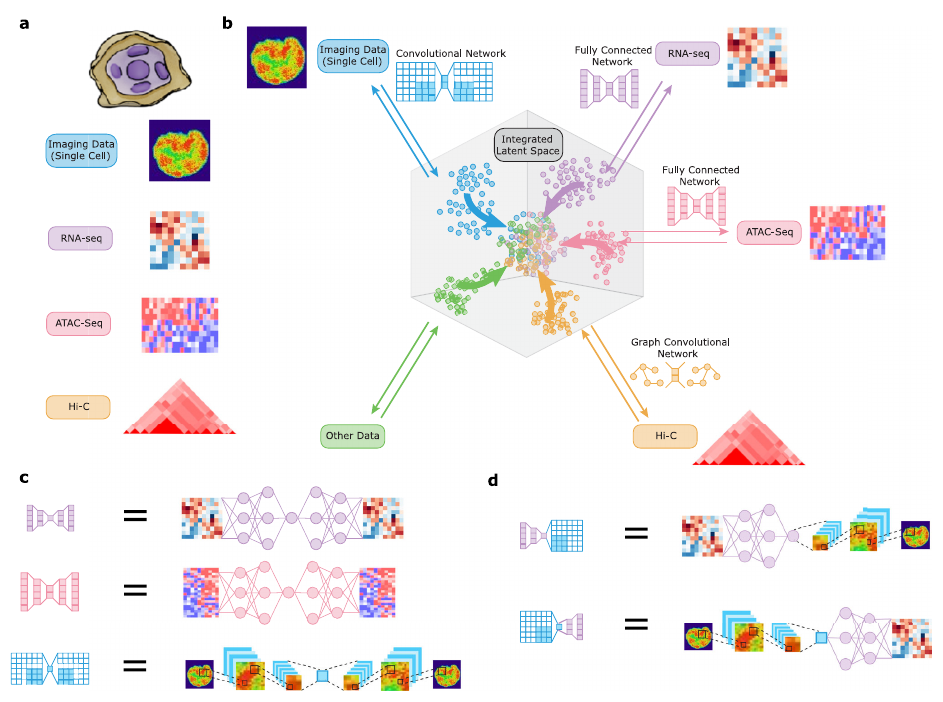
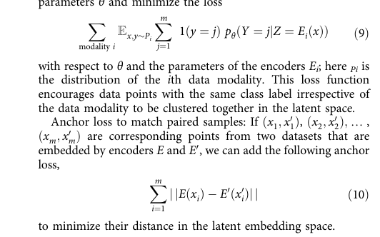

## **Methods**

(1) **OmiVAE** *Integrated Multi-omics Analysis Using Variational Autoencoders: Application to Pan-cancer Classification*

OmiVAE requires paired samples from two modalities. It creadtes joint embedding by concatenating the Encoder layers and deconcatenating the Decocer layers to allow for separately imputting and outputting two modalities.

The sample $x$ is given by a paired samples $x_1$, $x_2$ for two modalities written as $x = (x_1, x_2)$. The loss incorporates KL divergence, two reconstruction losses for different modalities and classification loss. The VAE part of the loss is given by the equation (1)
$$
\mathcal{L}_{\text{ELBO}}(x; \phi, \theta) = \mathcal{L}_{\text{KL}}(x; \phi, \theta) + d_1(x_1,\hat{x_1}) + d_2(x_2,\hat{x_2})
$$
Where reconstruction losses $d_1$, $d_2$ correspond to two different modalities. One may add weight hyperparameters to the loss definition. The classification part of the loss is crossentropy loss
$$
\mathcal{L}_{\text{class}}(x,y;\psi) = -\sum_{i=1}^N \log p_{y_i}(x_i)
$$
The total loss is expressed by equation (3)
$$
\mathcal{L}_{} = \alpha \cdot \mathcal{L}_{\text{ELBO}}(x; \phi, \theta) + \beta \cdot \mathcal{L}_{\text{class}}(x,y;\psi)
$$

(2) **BABEL** *BABEL enables cross-modality translation between multiomic profiles at single-cell resolution*

BABEL requires paired samples from two modalities. It uses pair of autoencoders, which output parameters of the input data distribution. The joint embedding space is learned by CycleGAN-like training procedure (it may be made even more CycleGAN-like), which exchganges the embedding and reconstruction betwwen modality Encoders and Decoders of modality specific autoencoders.

BABEL relaxes the assumption of the Gaussian distribution when formulating the reconstruction loss part from the log likelihood perspective and instead of using MSE as a derivative of log likelihook in the Gaussian case to estimate mean parameter of the output distribution it allows to specify the parametrised distibution at the output and adjust the log likelihood loss accordingly. Authors keep the assumption of the independence of the random vector entries as it is typically done and sum the loss components over the vector entries.

In the original paper RNA and ATAC modalities are considered with RNA entries assumed to come from marginally negative binomial distirbution and ATAC entries coming from  Bernoulli distibution.

The RNA marginal distribution for each entry is parametrised as it is usually done in negative binomial regression. (Why discrete?)

$\mathbb{P}[x;\mu, \theta] = \frac{\Gamma(x + \theta)}{x! \Gamma(x)} \left( \frac{\theta}{\theta + \mu} \right)^\theta \left( \frac{\mu}{\theta + \mu} \right)^x$

Where $\mu$ and $\theta$ stand for mean and dispersion parameter respectively. It leads to the loss component

$$\mathcal{L}_{RNA}(x; \mu, \theta) = -\theta(\log (\theta + \epsilon) - \log(\theta + \mu) - x (\log (\mu + \epsilon) - \log (\theta + \mu)) - \log\Gamma(x + \theta) + \log\Gamma(x + 1) + \log\Gamma(\theta + \epsilon))$$
<!--  -->

The ATAC marginal distribution for each entory is prarmetrised as Bernoulli as a bernoulli distribution leading to binary corssentropy loss.
$$\mathcal{L}_{ATAC}(x, p) = -(p\log x + (1 - p)\log(1 - x))$$

Where $p$ represents the true Bernoulli distibution parameter and $x$ is the output of the model.
<!--  -->
<!--  -->

The encoders and decoders of different modalities are interchanged and the reconstruction loss is calculated with respect to the true value of the other modality, which leads to four loss comonents for all encoder decoder pairs.

(3) **(noname) Adversarial VAE** *Multi-domain translation between single-cell
imaging and sequencing data using autoencoders*

In the adversarial VAE case the requirement of paired sampled from different modalities is relaxed although they may be used to refiene the procedure as well. Two VAEs are trained for distinct modalities and GAN-like objective is used to align two embedding spaces.

### Limitation
see the comments below about the modality specific local variation dimensions

### Comments
Modality unique local dimensions.
- allowed in OmiVAE setting
- allowed in BABEL setting
- punished with direct emebdding matching
- punished with discriminative loss as they are important only to one modality they are eaisily reduced for the other (the number of samples in each modality impacts the learning dynamics)