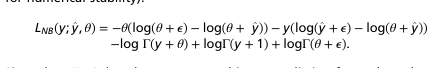

https://openproblems.bio/events/2021-09_neurips/

https://openproblems.bio/events/2021-09_neurips/documentation/about_tasks/task3_joint_embedding

#??? GEX and ADT distributions

$\mathbb{P}[x;\mu, \theta] = \frac{\Gamma(x + \theta)}{x! \Gamma(x)} \left( \frac{\theta}{\theta + \mu} \right)^\theta \left( \frac{\mu}{\theta + \mu} \right)^x$

Where $\mu$ and $\theta$ stand for mean and dispersion parameter respectively. It leads to the loss component

$$\log \mathbb{P}[x;\mu, \theta] = -\theta(\log (\theta + \epsilon) - \log(\theta + \mu) - x (\log (\mu + \epsilon) - \log (\theta + \mu)) - \log\Gamma(x + \theta) + \log\Gamma(x + 1) + \log\Gamma(\theta + \epsilon))$$
<!--  -->

# Metrics
May be found here
https://openproblems.bio/events/2021-09_neurips/documentation/about_tasks/task3_joint_embedding