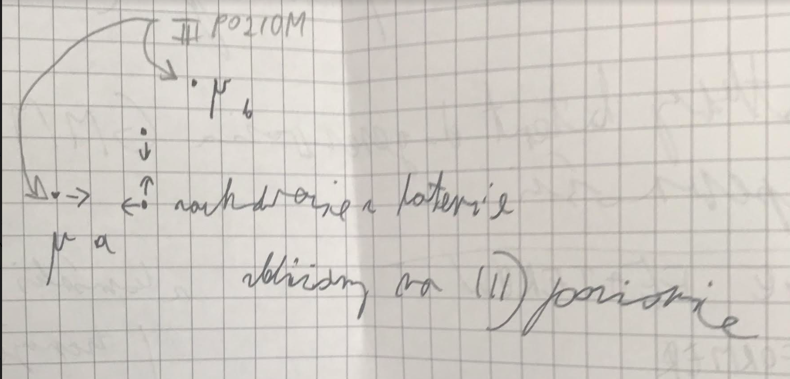

## **Setup**
- $p(x)$ - true data distribution (unknown analytical form)
- $p(z)$ - prior distribution of the latent variable (known analytical form)
- $f_\phi$ - encoder
- $q_\phi(z | x) \approx p(z | x)$ - approximate posterior on the latent distribution
- $h_\theta$ - decoder 
- $p_\theta(z | x) \approx p(x | z)$ - true posterior on data distribution

### Modelling $p(x, z)$
#### Clarification: Assume there is some true latent distribution of $z$. Because of that we use $\approx$ symbol below
$p(x, z) = \underbrace{p(z | x)}_{\text{unknown}} \cdot \underbrace{p(x)}_{\text{we can sample from it (we already sampled)}} \approx \underbrace{q_\phi(z | x)}_{\text{trained}} \cdot \underbrace{p(x)}_{\text{we can sample from it (we already sampled)}} \rightarrow \text{we can sample from } \approx p(x, z)$

$p(x, z) = \underbrace{p(x | z)}_{\text{unknown}} \cdot \underbrace{p(z)}_{\text{we can sample from it}} \approx \underbrace{p_\theta(x | z)}_{\text{trained}} \cdot \underbrace{p(z)}_{\text{we can sample from it}} \rightarrow \text{we can sample from } \approx p(x, z)$

### Modelling $p(x)$
$p(x) = \int_z \underbrace{p_\theta(x | z)}_{\text{unknown }} \cdot p(z) dz = \mathbb{E}_{p(z)}[p_\theta(x | z)] \leftarrow \text{MC approximation}$
We will use it as part of the training objective, although we won't be able to sample from it.

### VAE loss derivation - data likelihood perspective
$\log p(x) = \mathbb{E}_{q_\phi(z | x)}[\log p(x)] = \mathbb{E}_{q_\phi(z | x)}\left[ \frac{\log p_\theta(x, z)}{\log p(z | x)} \cdot \frac{\log q_\phi(z | x)}{\log q_\phi(z | x)} \right] = \underbrace{\mathbb{D}_{KL}[q_\phi(z | x) || p(z | x)]}_{\geq 0} + \overbrace{\mathbb{E}_{q_\phi(z | x)}\left[ \frac{\log p_\theta(x, z)}{\log q_\phi(z | x)} \right]}^{\text{ELBO}}$

<!-- $\mathcal{L}_\text{ELBO}(x;\phi, \theta) = \mathbb{E}_{q_\phi(z | x)}[\log p_\theta(x, z) - \log q_\phi(z | x)] \approx \log p_\theta(x, z) - \log q_\phi(z | x)$ -->

$\mathcal{L}_\text{ELBO}(\mathcal{D};\phi, \theta) = \sum_{x \in \mathcal{D}} \mathcal{L}_\text{ELBO}(x;\phi, \theta)$

Calculating $\mathcal{L}_\text{ELBO}(x;\phi, \theta)$ is intractable as it requirese integrating over $z$ and we estimate it with sampling (typically one sample).

$\mathcal{L}_{\text{ELBO}}(x; \phi, \theta) = \underbrace{-\mathbb{D}_{\text{KL}}[q_\phi(z | x) || p(z)]}_{\text{this is where we use analytical form}} + \underbrace{\mathbb{E}_{q_\phi(z | x)}[\log p_\theta(x | z)]}_{\log \text{likelihood } \approx \text{ reconstructions loss}}$

$\mathbb{D}_{\text{KL}}[q_\phi(z | x) || p(z)] = \overbrace{\underbrace{\int_z q_\phi(z | x) \cdot \log q_\phi(z | x) dz}_{ -\mathcal{H}(q_\phi(z | x)) }}^{\text{streaches } q(z | x) \ : \ \sigma\uparrow} - \overbrace{\int_z q_\phi(z | x) \cdot \log p(z) dz}^{\text{mode seeking } \rightarrow \text{ squeezes } q(z | x) \ : \ \sigma\downarrow}$

So the $\text{ELBO}$ effectively balances a different interests: reconstruction, squeezing and streaching "forces".

Second term of $\text{ELBO}$ is approximated with one sample.

$\nabla_\theta\mathcal{L}_{\text{ELBO}}(x; \phi, \theta) = \nabla_\theta\mathbb{E}_{q_\phi(z | x)}[\log p_\theta(x | z)] = \mathbb{E}_{q_\phi(z | x)}[\nabla_\theta \log p_\theta(x | z)]$

$\nabla_\phi\mathcal{L}_{\text{ELBO}}(x; \phi, \theta) = \nabla_\phi \underbrace{-\mathbb{D}_{\text{KL}}[q_\phi(z | x) || p(z)]}_{\text{this is where we use analytical form}} + \underbrace{\nabla_\phi\mathbb{E}_{q_\phi(z | x)}[\log p(x | z)]}_{\text{problem with finding an unbiased estimator}}$

## Gaussian prior $p(z)$ and posterior $q_\phi(z | x)$

$q_\phi(z | x) = \mathcal{N}(\mu_\phi(x), \Sigma_\phi(x)) = \frac{1}{(2\pi)^{d/2} |\Sigma_\phi|^{1/2}} \exp \left( -\frac{1}{2} (z - \mu_\phi(x))^\top \Sigma^{-1}_\phi (z - \mu_\phi(x)) \right) \leftarrow \text{with } \Sigma_\phi = \text{diag}(\sigma^2_\phi(x))$

$p(z) = \mathcal{N}(0, \mathbb{I}) = \frac{1}{(2\pi)^{d/2}} \exp \left( -\frac{1}{2} z^\top z \right)$

$\mathbb{D}_{\text{KL}}[q_\phi(z | x) || p(z)] = \overbrace{\underbrace{\int_z q_\phi(z | x) \cdot \log q_\phi(z | x) dz}_{ -\mathcal{H}(q_\phi(z | x)) }}^{\text{streaches } q(z | x) \ : \ \sigma\downarrow} - \overbrace{\int_z q_\phi(z | x) \cdot \log p(z) dz}^{\text{mode seeking } \rightarrow \text{ squeezes } q(z | x) \ : \ \sigma\uparrow}$

The second term may be simplified

$\int_z q_\phi(z | x) \cdot \log p(z) dz = \int_z q_\phi(z | x) \cdot \log \left( \frac{1}{(2\pi)^{d/2}} \exp \left( -\frac{1}{2} z^\top z \right) \right) = \log \left( \frac{1}{(2\pi)^{d/2}} \right) -\frac{1}{2} \int_z q_\phi(z | x) \cdot z^\top z dz = -\frac{d}{2}\log(2\pi) - \frac{1}{2} \sum_i \left( \sigma^2_{\phi, i}(x) + \mu^2_{\phi, i}(x) \right) \leftarrow \text{Are we assuming marginal Gaussians or is it implicit?}$

The first term may be simplified with calculations similar to the ones above

$\mathcal{H}(q_\phi(z | x)) = -\int_z q_\phi(z | x) \cdot \log q_\phi(z | x) dz = \frac{d}{2}\log(2\pi) + \frac{1}{2} \sum_i \log \sigma^2_{\phi, i}(x) + \frac{1}{2} \int_z (z - \mu_\phi(x))^\top \text{diag}(\sigma^2_\phi(x))^{-1} (z - \mu_\phi(x)) dz = \frac{d}{2}\log(2\pi) + \frac{1}{2}  \sum_i \log \sigma^2_{\phi, i}(x) + \frac{d}{2}$

Finally combining the results

$\mathbb{D}_{\text{KL}}[q_\phi(z | x) || p(z)] = -\mathcal{H}(q_\phi(z | x)) - \int_z q_\phi(z | x) \cdot \log p(z) dz = -\frac{d}{2}\log(2\pi) - \frac{1}{2} \sum_i \log \sigma^2_{\phi, i}(x) - \frac{d}{2} + \frac{d}{2}\log(2\pi) + \sum_i \left( \sigma^2_{\phi, i}(x) + \mu^2_{\phi, i}(x) \right) = -\frac{1}{2}\sum_i \left( 1 + \sigma^2_{\phi, i}(x) - \mu^2_{\phi, i}(x) - \log \sigma^2_{\phi, i}(x) \right)$

### Trainable Gaussisan Mixture prior and Gaussian posterior
* $x_{i, k} = k'$ - the cluster/GM of $i$-th example

$p(z) = \sum_{k = 1}^K \pi_k \cdot \mathcal{N}(\mu_k, \Sigma_k)$

Posterior prior xd

$p(z | x_k = k') = \sum_{k = 1}^K \pi_{k | x_k = k'} \cdot \mathcal{N}(\mu_k, \Sigma_k) \stackrel{\pi_{k | x_k = k'} = \delta_{k'}(k)}{=} \mathcal{N}(\mu_{k'}, \Sigma_{k'})$

The posterior stays the same as above.

When the cluster assignment is unknown the GM prior is used with mode seeking behaviour and possibililty of attraction to suboptimal cluster. Likely though the simmilar examples will be clustered in the same area even in fully unlabeled case. The analytical form is not as clean as in the Gaussian case. The log of the GM may be seen as logsumexp because of exp in the gaussian formula and it is dependent od the likelihood of being in each cluster separately.

# **TBD ...**
### Gaussing Mixture prior and posterior
The reparametrisation is two-fold gumbel softmax trics followed by standard reparametrisation for the chosen Gaussian Mixture component. How to compare the prior to posterior? should we compare just one component? or like NALEŚNIK "run the sample through" all clusters how then match the corresponding clusters with the prior ones? (perhaps the same way as in the Gaussian posterior case)

<!-- One could do $\pi$ weighted sampling from GM and get logsumexp in the logs  -->

## it reduces batch effect...? with respecto to Gaussian?

# **TBD** ...
### Hierarchical prior GMM -> GMM (with the upper level GMM having the mu = (mu_leftchild + mu_rightchild) / 2)

We may specify hierarchy over the clusters II) $\frac{\mu_a + \mu_b}{2}$ one gaussian III) $\mu_a$ $\mu_b$ two GM components. The $\sigma$ may be set to $1$.

In the usual case the mu's are pulled to 0 because of the prior (the mus from the encoder)

Here if the example is from mu_a then it is pulled towards mu_a and the higher level mu effectively pulling the example to the second mu as well. the pulling is from both sides so the mus are pulled to the example as well (even the mu from the other cluster because of of pulling of the higher level cluster mean incorporationg it).

# When matching two latents we may do it with the common trainable GM priors and do e. g. BABEL (what about other approaches?)

<!-- ### Non-factorized prior & posterior
... -->

### VAE Loss

$\mathcal{L}_{\text{ELBO}}(x; \phi, \theta) = \mathcal{L}_{\text{KL}}(x; \phi, \theta) + \overbrace{d(x,\underbrace{\mathbb{E}_{q_\phi(z | x)}[h_\theta(z)]}_{\approx \text{ with one sample}})}^{\text{reconstruction loss}}$

For simplicity we will write $\hat{x} \approx \mathbb{E}_{q_\phi(z | x)}[h_\theta(z)]$